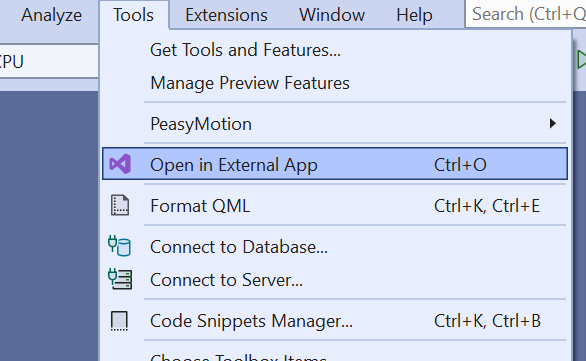
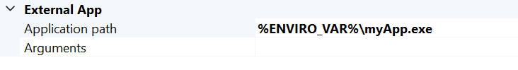

    
    

# OpenFileInExternalApplication
Visual Studio 22 extension to invoke custom command on active file

## Tools

    

## Options
- Open File in External App

    

## Key Shortcut

- OpenFilelnExternalApplication.OpenFileCommand

